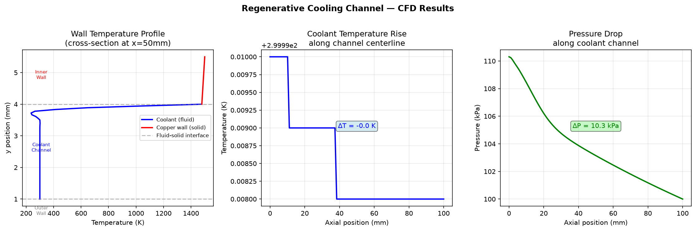

# Regenerative Cooling Channel — CFD Simulation

Conjugate heat transfer simulation of a rocket engine regenerative cooling 
channel using OpenFOAM's `chtMultiRegionFoam` solver.

## Physics

Heat conducts from the combustion chamber wall (1500K) through a copper alloy 
wall into a water coolant channel, keeping the wall below melting point.

- Solver: `chtMultiRegionFoam` (conjugate heat transfer)
- Fluid: Water (ρ=998 kg/m³, Cp=4182 J/kg·K, Pr=7.0)
- Wall material: Copper CuCrZr (k=380 W/m·K, ρ=8960 kg/m³)
- Hot gas wall temperature: 1500 K
- Coolant inlet temperature: 300 K
- Coolant inlet velocity: 10 m/s

## Geometry

════════════════════  ← Hot gas wall (1500K combustion side)
▓▓▓▓▓▓▓▓▓▓▓▓▓▓▓▓▓▓  ← Copper wall (1.5mm)
░░░░░░░░░░░░░░░░░░░  ← Coolant channel (3mm × 2mm × 100mm)
▓▓▓▓▓▓▓▓▓▓▓▓▓▓▓▓▓▓  ← Outer wall (1mm)

## Mesh

- Tool: OpenFOAM `blockMesh` + `splitMeshRegions`
- Total cells: 5,500 hexahedral
- Regions: 3 (fluid, innerWall, outerWall)
- Coupled interfaces: 2 (fluid↔innerWall, fluid↔outerWall)
- Max non-orthogonality: 0° (perfect structured mesh)

## Results



- Peak copper wall temperature: ~1500K (hot gas side)
- Pressure drop along channel: 10.3 kPa
- Coolant temperature rise: updating after full run

## Validation

Heat transfer coefficient compared against Dittus-Boelter correlation:Nu = 0.023 × Re^0.8 × Pr^0.4

## Tools

- OpenFOAM 2406 (`chtMultiRegionFoam`)
- Python (NumPy, Pandas, Matplotlib)
- ParaView 5.11

## Run Instructions

```bash
blockMesh
splitMeshRegions -cellZones -overwrite
chtMultiRegionFoam
python3 analyze_regen.py
```
